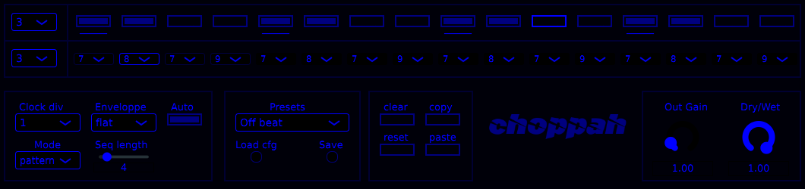

# Choppah

As I haven't found yet any trance gate VST for linux, DIY was the only way.

**IMPORTANT** For the moment the processing part has just started, so it may sound **CRAP**.

It is my very first JUCE project and i suck at C++ so...apologies for the crappy code ^^ .

## Description

The chopper has 2 modes : pattern & sequence.

In **pattern** mode, the step seq (first line) current selected pattern is looping
You can change the pattern to play/edit with the upper left combo box.
Patterns have a fixed length of 16.

In **sequence** mode, the chopper runs the combobox sequence of patterns (second line).
The current sequence can be changed with the corresponding combobox to the left.
**Seq length** bottom left slider changes the sequence length.

To stop auto pattern display in **sequence** mode, disable **Auto** button.

**Clock division** applies for pattern mode only.

**Clear** erases current selected pattern.

**Reset** erases all patterns.

**Copy** copies the current selected pattern.

**Paste** pastes the clipboard content into current pattern.If no copy was done, it is an empty pattern.

**Load cfg** reloads plugin default state (defined in **config.xml**).

**Save** saves preset to the name filled in **Presets**, if the preset already exists, it will be overwritten.

Click on the logo to switch between skins.

**NOTE :** Theres a bug on some combo boxes : sometimes the button doesnt change the value.The workaround is to click on the combobox (not on the arrow) then reclick here again,then you can change values with **Up/Down keys**.  

## Requirements
JUCE Version 7.0.7

gcc

## Installation
### Linux
 - get the pre-built **chopper.vst3** folder in **Releases** or build it (see below).
 - put it in your VST3 folder
 - run the script `./Ressources/scripts/copy_plugin_data.sh [path to downloaded github stuff]`

It will create the folders and copy the plugin data in **${HOME}/.ssabug/choppah/**

 - load the plugin in your DAW

## Building 
### Linux
 - git clone the repo or get a release zip. Extract if necessary.
 - Then `cd choppah`  
 - Run the build script with `./Ressources/scripts/build_linux_vst3.sh "$(pwd)"`
 - The script will ask for your **JUCE/modules** path
 - the VST3 folder will be in the  **Builds/LinuxMakefile/build/chopper.vst3** directory

## Testing
### Linux
#### Distro
- [x] Fedora
- [x] Arch Linux
#### DAWs
- [x] Bitwig
- [ ] Tracktion Waveform 12
- [ ] Carla / Zrythm
- [ ] Ardour 
- [x] Qtractor 
### Windows
#### DAWs
- [ ] Ableton

## History
see  for more details.